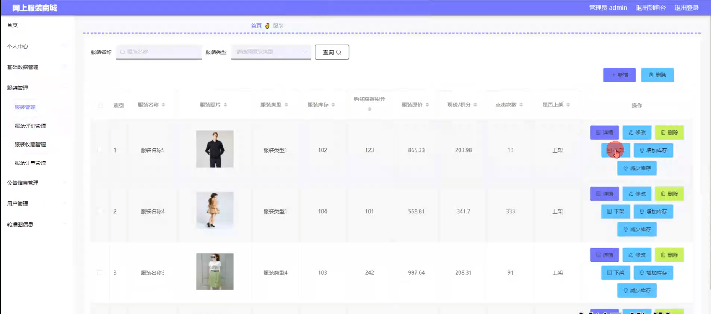

# 基于springboot的网上服装商城

#### 介绍

在互联网的高速发展和电子商务的普及背景下，网上购物成为了人们日常生活中不可或缺的一部分。服装作为人们消费的重要领域，网上服装商城的需求日益增长。然而，现有的一些网上服装商城存在着服装分类不清晰、用户体验不佳、管理功能不完善等问题。
本基于 Spring Boot 的网上服装商城系统旨在为用户提供便捷、高效的购物体验，同时为管理员提供全面、精细的管理功能，以满足市场对优质网上服装商城的需求。

#### 技术栈

后端技术栈：Springboot+Mysql+Maven

前端技术栈：Vue+Html+Css+Javascript+ElementUI

开发工具：Idea+Vscode+Navicate

#### 系统功能介绍

（一）管理员角色  
个人中心：管理员可在个人中心查看和修改个人信息，查看系统操作记录和通知。  
基础数据管理  
服装类型管理：对服装的类别进行添加、修改和删除，如上衣、裤子、裙子、内衣等，确保服装分类清晰准确，方便用户查找。  
公告类型管理：定义不同类型的公告，如促销活动公告、新品上架公告、系统维护公告等，以便有针对性地向用户传达信息。  
会员等级类型管理：设置会员的等级体系，如普通会员、高级会员、VIP 会员等，并为不同等级的会员设定相应的权益和优惠政策。  
服装管理  
服装管理：负责服装的上架、下架、库存管理和基本信息维护，包括服装的名称、品牌、款式、颜色、尺码、价格等。  
服装评价管理：查看和处理用户对服装的评价，及时了解用户反馈，对于好评可以进行展示以增加其他用户的购买信心，对于差评要及时与用户沟通并采取改进措施。  
服装收藏管理：了解用户对服装的收藏情况，分析热门收藏款式，为采购和推荐提供参考。  
服装订单管理：处理服装订单，包括订单确认、发货、退款等操作，确保订单流程的顺利进行。  
公告信息管理：发布、编辑和删除公告信息，确保用户及时了解商城的最新动态和优惠活动。  
用户管理：管理用户的注册信息、账户状态、消费记录等，对违规用户进行处理，保障商城的正常运营。  
轮播图信息：设置商城首页的轮播图，展示热门服装、促销活动、品牌形象等，吸引用户的注意力。  

（二）用户角色  
服装：浏览各类服装商品，查看详细的服装介绍、图片和价格。  
公告信息：及时获取商城发布的公告，了解促销活动、新品上架等信息。  
个人中心：管理个人资料、收货地址、订单记录、收藏的服装等。  
后台管理  
服装管理  
服装管理：对关注的服装进行跟踪，了解库存变化。  
服装评价管理：发表对购买服装的评价和晒单。  
服装收藏管理：收藏心仪的服装，方便后续购买。  
服装订单管理：查看订单状态，进行订单确认、支付、退换货等操作。  
公告信息管理：查看历史公告，确保不错过重要信息。  
用户管理：修改个人信息和密码，保障账户安全。  
购物车：将心仪的服装加入购物车，进行结算和支付。  

#### 系统作用

提升用户购物体验  
为用户提供丰富的服装选择、便捷的购物流程和个性化的服务，满足用户的多样化需求。  

提高管理效率  
帮助管理员实现对商城的高效管理，包括服装的库存控制、用户的管理和市场活动的策划与执行。  

增强市场竞争力  
通过精准的服装推荐、优质的客户服务和有效的营销策略，吸引更多用户，提高商城的市场份额。  

促进服装销售  
及时展示热门服装和促销活动，刺激用户的购买欲望，增加服装的销售量。  

#### 系统功能截图

代码结构

数据库表

登录

前台页面首页

服装模块

个人中心

购物车

管理员端基础数据管理

服装管理

服装订单管理

用户管理

轮播图信息管理

用户端后台管理

公告信息

#### 总结

基于 Spring Boot 的网上服装商城系统为用户和管理员提供了全面而便捷的功能。然而，该系统仍可能存在一些局限性，如在高并发情况下的性能优化、对新兴支付方式的支持不够完善、对服装搭配推荐的智能化程度有待提高等。未来，我们将持续改进和完善系统，提升系统的稳定性和扩展性，加强与供应链的整合，为用户和管理员带来更优质的服务和体验，推动网上服装商城的发展。

#### 使用说明

创建数据库，执行数据库脚本 修改jdbc数据库连接参数 下载安装maven依赖jar 启动idea中的springboot项目

前台登录页面
http://localhost:8080/fuzhuangshangcheng/front/index.html

后台登录页面
http://localhost:8080/fuzhuangshangcheng/admin/dist/index.html

管理员				账户:admin 		密码：admin

用户				账户:a1 		密码：123456